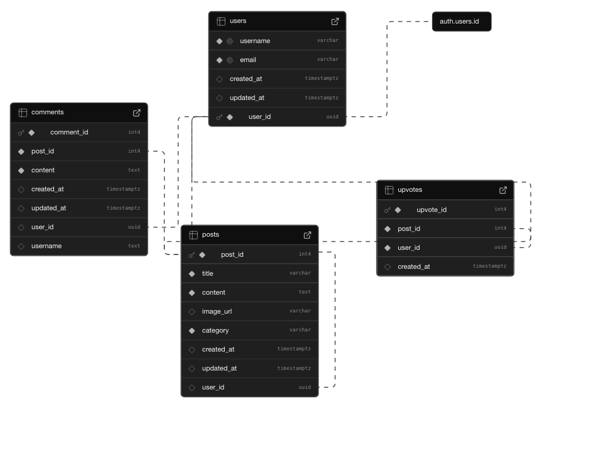

[Visit the Website](https://onesmallwin.vercel.app/)

🌱One Small Win is a lightweight, feel-good forum app where users can share their daily micro-achievements — no matter how small. Whether it's drinking more water, cleaning your desk, or finally sending that email, this app is about building momentum and celebrating progress over perfection.

Users can:

📌 Post their wins with a title, optional content, and an image URL

👏 Upvote and encourage others

🔍 Sort and search posts by time or popularity

💬 Leave comments and share support

Built with React, Vite, and Supabase.

## Features Implemented

- [x] Web app includes a create form that allows the user to create posts

  - Form requires users to add a post title
  - Forms should have the option for users to add:
     - additional textual content
     - an image added as an external image URL

- [x] Web app includes a home feed displaying previously created posts

  - Web app must include home feed displaying previously created posts
  - By default, each post on the posts feed should show only the post's:
     - creation time
     - title
     - upvotes count
  - Clicking on a post should direct the user to a new page for the selected post

- [x] Users can view posts in different ways

  - Users can sort posts by either:
    - creation time
    - upvotes count
    - Users can search for posts by title

- [x] Users can interact with each post in different ways

  - The app includes a separate post page for each created post when clicked, where any additional information is shown, including:
    - content
    - image
    - comments
  - Users can leave comments underneath a post on the post page
  - Each post includes an upvote button on the post page.
    - Each click increases the post's upvotes count by one
     - Users can upvote any post any number of times

- [x] A post that a user previously created can be edited or deleted from its post pages

  - After a user creates a new post, they can go back and edit the post
  - A previously created post can be deleted from its post page

  - [x] The database is built using Postgresql in Supabase

  ## Here's a walkthrough of implemented features:

  ##  Here's a picture of the database schema
